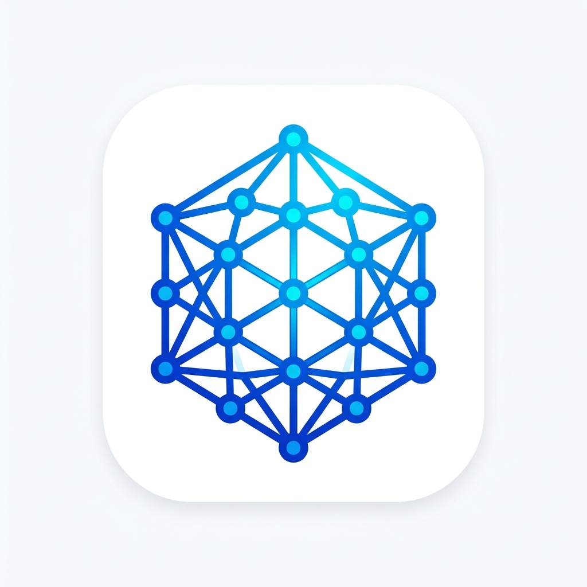
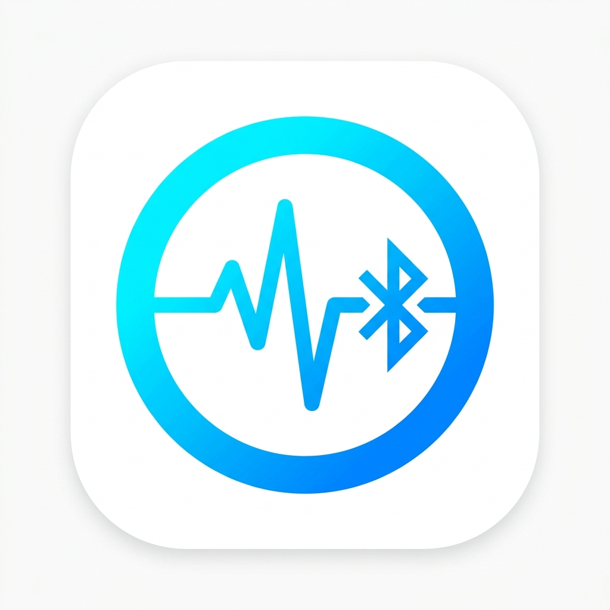

# AMRiT-Sudo

# 🌐 BlueMesh Ecosystem: Smart BLE Mesh Attendance & Biometric System

<div align="center">



### **Next-Generation Decentralized BLE Mesh Attendance & Student Monitoring**

[](https://flutter.dev)
[](https://dart.dev)
[]()
[]()
[]()

</div>

---

## 🚀 Prototype Releases (v1.0.0 Direct APK Downloads)

Direct download links for evaluating the working Android prototypes:

| App | Icon | Role | Release Download | Size | SHA-256 |
|---|:---:|---|---|---|---|
| **BlueMesh Staff** |  | **Faculty Host & Mesh Visualizer** | [📥 **Download BlueMesh-Staff-v1.0.0.apk**](releases/BlueMesh-Staff-v1.0.0.apk) | `48.8 MB` | `cf21b9e5f955...` |
| **BlueBand Student** |  | **Student Node & Biometric ID** | [📥 **Download BlueBand-Student-v1.0.0.apk**](releases/BlueBand-Student-v1.0.0.apk) | `46.3 MB` | `8d4b4570a9dc...` |

> 📌 *Detailed checksums and release documentation can be found in [`releases/RELEASE_NOTES_v1.0.0.md`](releases/RELEASE_NOTES_v1.0.0.md) and [`releases/checksums.txt`](releases/checksums.txt).*

---

## 🌟 Overview & Architecture

**BlueMesh** is an offline-capable, decentralized attendance and telemetry ecosystem designed for educational institutions and organizations. It solves the proxy attendance problem by combining **hardware-grade biometric authentication** with **Bluetooth Low Energy (BLE) dynamic mesh proximity tracking**.

```
  ┌────────────────────────────────────────────────────────┐
  │              👨‍🏫 BlueMesh Staff (Host Node)             │
  │     • BLE Advertising & GATT Master                    │
  │     • Real-time Animated Mesh Visualizer               │
  │     • Automated Roster & Session Analytics (SQLite)    │
  └──────────────────────────┬─────────────────────────────┘
                             │  BLE Radio Waves (RSSI & Packets)
            ┌────────────────┴────────────────┐
            ▼                                 ▼
┌───────────────────────────────┐ ┌───────────────────────────────┐
│ 🎓 BlueBand Student Node #1   │ │ 🎓 BlueBand Student Node #2   │
│ • Local Fingerprint / Face ID │ │ • Local Fingerprint / Face ID │
│ • Encrypted BLE Heartbeat     │ │ • Encrypted BLE Heartbeat     │
│ • Real-time Pulse & Ping Log  │ │ • Real-time Pulse & Ping Log  │
└───────────────────────────────┘ └───────────────────────────────┘
```

---

## 🎨 Minimalist Light-Theme App Logos

Both applications feature modern, minimal, light-theme vector icons designed for instant recognition and high visual impact:

<div align="center">
<table>
  <tr>
    <td align="center" width="50%">
      <br/><br/>
      <b>BlueMesh Staff</b><br/>
      <sub>Hexagonal Mesh Network Hub & Shield Emblem</sub>
    </td>
    <td align="center" width="50%">
      <br/><br/>
      <b>BlueBand Student</b><br/>
      <sub>Smart Wristband Biometric Pulse & BLE Wave Glyph</sub>
    </td>
  </tr>
</table>
</div>

---

## 📱 Application Modules

### 1. `bluemesh` (Staff & Faculty Hub)
- **BLE Host Service**: Broadcasts custom service UUID `0000AAA1-0000-1000-8000-00805F9B34FB` with write & notify characteristics.
- **Dynamic Topology Visualizer**: Custom Canvas engine rendering real-time mesh nodes, distance estimation via RSSI, ping histories, and active/idle states.
- **Session & Attendance Engine**: Real-time duration calculation, automated present/incomplete thresholds, and SQLite local storage.
- **Reports & Export**: Complete historical analytics with one-tap CSV export and system sharing.

### 2. `blueband` (Student Companion)
- **Biometric Security**: Built-in biometric verification (`local_auth`) ensuring proxy-proof validation.
- **BLE Mesh Client**: Scans for active host sessions, negotiates connection, and transmits periodic signed heartbeats.
- **Hardware Status Simulation**: Visual LED indicator, connection status rings, and low-level BLE packet telemetry logs.
- **Identity Manager**: Configurable student Roll Number, Name, and Section.

---

## 🛠️ Getting Started & Local Development

### Prerequisites
- **Flutter SDK**: `^3.11.3` or later
- **Android SDK**: `API Level 24+` (Android 7.0 or newer)
- **Device Requirements**: Physical devices with Bluetooth 4.2+ (BLE support)

### Run the Projects

#### Running BlueMesh Staff:
```bash
cd bluemesh
flutter pub get
flutter run
```

#### Running BlueBand Student:
```bash
cd blueband
flutter pub get
flutter run
```

### Build Release APKs:
```bash
# BlueMesh Staff APK
cd bluemesh
flutter build apk --release

# BlueBand Student APK
cd blueband
flutter build apk --release
```

---

## 📁 Repository Structure

```
bluemesh-ecosystem/
├── README.md                          # Main repository documentation & prototype links
├── .gitignore                         # Root git ignore
├── releases/                          # Standalone prototype release binaries & notes
│   ├── BlueMesh-Staff-v1.0.0.apk      # Staff application release build
│   ├── BlueBand-Student-v1.0.0.apk    # Student companion release build
│   ├── RELEASE_NOTES_v1.0.0.md        # Detailed v1.0.0 release notes
│   ├── checksums.txt                  # SHA-256 verification hashes
│   └── assets/                        # Logo and badge assets
│       ├── bluemesh_icon.png
│       └── blueband_icon.png
├── bluemesh/                          # BlueMesh Staff Flutter project
│   ├── lib/
│   │   ├── core/                      # Constants, SQLite DB, Theme Provider
│   │   ├── models/                    # AttendanceRecord, Session, Student, Node
│   │   ├── screens/                   # Auth, Dashboard, Mesh Visualizer, Reports
│   │   └── services/                  # BLE Host Service, Attendance Service
│   └── pubspec.yaml
└── blueband/                          # BlueBand Student Flutter project
    ├── lib/
    │   ├── core/                      # BLE Constants & Helpers
    │   ├── models/                    # BLE Packets
    │   ├── screens/                   # Band Home, Identity Settings
    │   ├── services/                  # Biometric, BLE Client, Identity Service
    │   └── widgets/                   # Fingerprint, LED, Packet Logs
    └── pubspec.yaml
```

---

## 📄 License
This project is open-source and available under the [MIT License](LICENSE).
